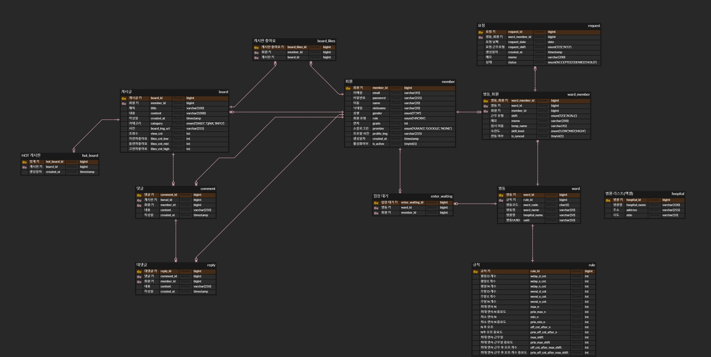

# 포팅 매뉴얼

날짜: 2025년 2월 20일

## 1. 프로젝트 개요

- 프로젝트명: 듀티메이트(Dutymate.)
- GitLab Repository: [https://lab.ssafy.com/s12-webmobile2-sub1/S12P11A108](https://lab.ssafy.com/s12-webmobile2-sub1/S12P11A108)

## 2. 개발 환경

### 2.1 사용 기술 및 버전

**IDE**

- IntelliJ IDEA 2024.3, Visual Studio Code 1.97.2

**Frontend**

- TypeScript 5.6.2
- React 18.3.1, Zustand 5.0.3, Axios 1.7.9, react-query 5.66.0
- Tailwind CSS 3.4.17
- Vite 6.0.5

**Backend**

- Liberica JDK 21.0.6, Spring Boot 3.4.1
- Spring Data JPA, Spring Data Redis, Spring Data MongoDB
- JWT, OAuth2.0
- MySQL 8.0.40, Valkey 7.2.6, DocumentDB 5.0
- Hibernate 6.6.4, JJWT 0.12.6, AWS SDK 2.29.52
- Gradle 7.5

**Infrastructure**

- Docker, Docker Compose, Jib
- GitLab, GitLab CI (Lightsail)
- HCL, Terraform(1.10.5), Terraform Backend (S3 + DynamoDB)
- CloudFront, S3, ECS, RDS, ElasitCache, DocumentDB, WAF, SSM

**FinOps**

- Infracost

## 3. GitLab 소스 클론 및 빌드

### 3.1 GitLab 소스 클론

```
 git clone https://lab.ssafy.com/s12-webmobile2-sub1/S12P11A108.git
 cd [프로젝트 디렉토리]
```

### 3.2 환경 변수 설정

- 프로젝트 최상단 backend 폴더 내에  `.env` 파일을 생성하여 환경 변수를 설정합니다.

```java
# MySQL DataSource 설정
SPRING_DATASOURCE_URL=jdbc:mysql://i12a108.p.ssafy.io:3306/dutymate_db?characterEncoding=UTF-8&serverTimezone=Asia/Seoul
SPRING_DATASOURCE_USERNAME=root
SPRING_DATASOURCE_PASSWORD=
SPRING_DATASOURCE_DRIVER_CLASS_NAME=com.mysql.cj.jdbc.Driver

# MongoDB 설정
SPRING_DATA_MONGODB_URI=mongodb://dutymate_admin:@i12a108.p.ssafy.io:27017/dutymate_mongo?authSource=admin
SPRING_DATA_MONGODB_DATABASE=dutymate_mongo

# Redis 설정
SPRING_DATA_REDIS_HOST=i12a108.p.ssafy.io
SPRING_DATA_REDIS_PORT=6379
SPRING_DATA_REDIS_SSL_ENABLED=false

# 로그 설정
DECORATOR_DATASOURCE_P6SPY_ENABLE_LOGGING=true

# JWT 비밀키 및 유효기간 설정
JWT_SECRET=
JWT_EXPIRATION=86400000

# KAKAO 소셜 로그인 환경변수
KAKAO_CLIENT_ID=
KAKAO_TOKEN_URI=https://kauth.kakao.com/oauth/token
KAKAO_USER_URI=https://kapi.kakao.com/v2/user/me
KAKAO_REDIRECT_URI=http://localhost:5173/oauth/kakao

# GOOGLE 소셜 로그인 환경변수
GOOGLE_CLIENT_ID=
GOOGLE_CLIENT_SECRET=
GOOGLE_TOKEN_URI=https://oauth2.googleapis.com/token
GOOGLE_USER_URI=https://oauth2.googleapis.com/tokeninfo
GOOGLE_REDIRECT_URI=http://localhost:5173/oauth/google

# AWS 설정
CLOUD_AWS_CREDENTIALS_ACCESS_KEY=
CLOUD_AWS_CREDENTIALS_SECRET_KEY=
CLOUD_AWS_REGION_STATIC=ap-northeast-2
CLOUD_AWS_S3_BUCKET=dutymate-bucket-dev
CLOUD_AWS_STACK_AUTO=false

# 네이버 뉴스 API 환경변수
NAVER_CLIENT_ID=
NAVER_CLIENT_SECRET=

# OPENAI 환경변수
OPENAI_SECRET_KEY=
OPENAI_MODEL=gpt-3.5-turbo
```

- 프로젝트 최상단 frontend 폴더 내에  `.env` 파일을 생성하여 환경 변수를 설정합니다.

```java
# API URL 설정
VITE_API_URL=http://localhost:8080/api

# 기타 환경 변수들
VITE_APP_NAME=DutyMate
VITE_APP_VERSION=1.0.0

# 타임아웃 설정 (밀리초)
VITE_API_TIMEOUT=10000

# 개발 환경 설정
VITE_NODE_ENV=development 

# 카카오 로그인 URL
VITE_KAKAO_LOGIN_URL=https://kauth.kakao.com/oauth/authorize?client_id=dc9758f762b36b3dea542a3bcf9322dd&redirect_uri=http://localhost:5173/oauth/kakao&response_type=code

# 구글 로그인 URL
VITE_GOOGLE_LOGIN_URL=https://accounts.google.com/o/oauth2/auth?client_id=302754189412-hedkvva46ecb7eh08c4cc86rd294e7oa.apps.googleusercontent.com&redirect_uri=http://localhost:5173/oauth/google&response_type=code&scope=https://www.googleapis.com/auth/userinfo.email%20https://www.googleapis.com/auth/userinfo.profile

# 튜토리얼 URL
VITE_TUTORIAL_URL=https://holly-notify-d06.notion.site/19d602a7a1d180d7ab39cc0d25b0e712?pvs=4

# 개인정보 처리방침 URL
VITE_PRIVACY_POLICY_URL=https://holly-notify-d06.notion.site/19f602a7a1d18008a568f603b0f97cae?pvs=4
```

- 프로젝트 최상단 infrastructure 폴더 내에 `terraform.tfvars` 파일을 붙여넣기 합니다.

```java
availability_zones = ["ap-northeast-2a", "ap-northeast-2c"]

aws_profile = "dutymate-terraform"

aws_region = "ap-northeast-2"

database_subnet_cidr_block = ["10.0.160.0/20", "10.0.176.0/20"]

domain_name = "dutymate.net"

google_site_verification_code = "google-site-verification=R5QjBPneqoU09z7Dx_QwJ-JEGP20WTcnm3oHzs1xK_M"

health_check_path = "/actuator/health"

mongodb_password = ""

mongodb_username = "dutymate_admin"

mysql_password = ""

mysql_username = "dutymate_admin"

private_subnet_cidr_block = ["10.0.128.0/20", "10.0.144.0/20"]

public_subnet_cidr_block = ["10.0.0.0/20", "10.0.16.0/20"]

route53_zone_id = ""

vpc_cidr = "10.0.0.0/16"
```

- awscli 설치 후, 생성한 IAM 사용자의 토큰을 설정합니다.
(참고) https://docs.aws.amazon.com/ko_kr/IAM/latest/UserGuide/id_credentials_access-keys.html

### CI/CD Variables
```
AWS_DEFAULT_REGION={AWS_DEFAULT_REGION}
AWS_ECR_ACCESS_KEY_ID={AWS_ECR_ACCESS_KEY_ID}
AWS_ECR_REPO_URI={AWS_ECR_REPO_URI}
AWS_ECR_SECRET_KEY={AWS_ECS_SECRET_KEY}
AWS_ECS_CLUSTER_NAME={AWS_ECS_CLUSTER_NAME}
AWS_ECS_SERVICE_NAME={AWS_ECS_SERVICE_NAME}
AWS_FRONTEND_ACCESS_KEY_ID={AWS_FRONTEND_ACCESS_KEY_ID}
AWS_FRONTEND_BUCKET_NAME={AWS_FRONTEND_BUCKET_NAME}
AWS_FRONTEND_SECRET_KEY={AWS_FRONTEND_SECRET_KEY}
ENV_FILE={BE_ENV_FILE}
FE_ENV_FILE={FE_ENV_FILE}
```

### 3.3 빌드 실행

Gradle 기준:

```bash
 gradlew build
```

React 기준:

```bash
npm run build
```

Terraform 기준:

```bash
terraform apply
```

## 4. 배포

### 4.1 배포 서버 설정

- OS: Amazon Linux 2
- 방화벽 설정: 80, 443 포트 오픈

### 4.2 배포 절차

```
terraform apply
```

### 4.3 배포 특이사항

- 로그 확인 : SSM 또는 AWS CloudWatch 확인

## 5. 데이터베이스 설정

### 5.1 ERD 및 주요 테이블



## 6. 외부 서비스 정보

(API Key는 별도로 발급받아 적용해야 합니다.)

### 6.1 소셜 로그인 (OAuth2)

- **Google OAuth2**
- **Kakao OAuth2**

### 6.2 AWS S3
- AWS_ACCESS_KEY와 AWS_SECRET_KEY를 backend 폴더 .env 파일 내에 삽입해야 합니다.

### 6.3 네이버 뉴스 API
- 네이버 API CLIEND_ID와 SECRET_KEY를 backend 폴더 .env 파일 내에 삽입해야 합니다.

### 6.4 OpenAI API
- OpenAI API SECRET_KEY를 backend 폴더 .env 파일 내에 삽입해야 합니다.

## 7. 인프라스트럭처 구성

